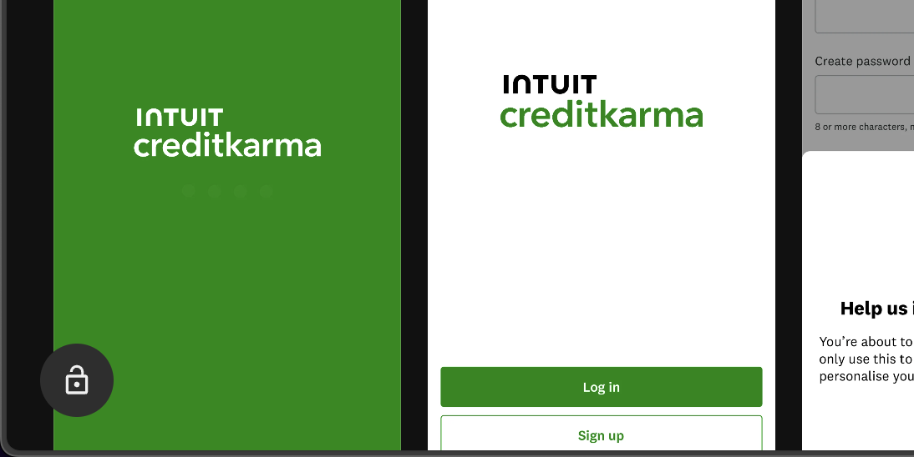

<p align="center">
  
</p>

<h1 align="center">Design Library Unlocked</h1>

<p align="center">
  <b>Buka semua fitur Pro design library populer — gratis, tanpa login, tanpa langganan.</b><br/>
  Chrome / Edge / Brave extension yang menghapus paywall, blur, dan tint overlay pada screenshot premium.
</p>

<p align="center">
  <b>Supported sites:</b>
  <a href="https://mobbin.com">Mobbin</a> ·
  <a href="https://chamjo.design">Chamjo</a>
</p>

<p align="center">
  
  
  
  
  
</p>

---

##  Fitur

-  **Auto-unlock screenshot premium** — semua app screen di-upgrade ke resolusi penuh **1920px WebP** otomatis.
-  **Hapus blur paywall** — strip CSS `filter: blur()`, `backdrop-blur`, dan class Tailwind `blur-*`.
-  **Hapus tint overlay** — buang sibling `<div>` yang menutupi gambar dengan layer ungu/biru semi-transparan.
-  **Hapus banner upgrade** — sembunyikan paywall sidebar dan upsell popup.
-  **SPA-friendly** — pakai `MutationObserver` jadi tetap jalan saat navigasi internal Next.js Mobbin.
-  **Lazy-load aware** — multi-pass scan (500ms / 1.5s / 3s / 6s) menangkap gambar yang baru ter-render.
-  **Badge indikator** — tombol  di pojok kiri-bawah menampilkan jumlah gambar yang berhasil di-unlock.

---

##  Instalasi

### Chrome / Edge / Brave (Manual)

1. **Download / clone** repo ini:
   ```bash
   git clone https://github.com/harezadmm/mobbin-unlocked.git
   ```
   Atau klik **Code → Download ZIP** lalu extract.

2. Buka **`chrome://extensions`** (atau `edge://extensions` / `brave://extensions`).

3. Aktifkan **Developer mode** (toggle di pojok kanan-atas).

4. Klik **Load unpacked** → pilih folder `mobbin-unlocked` yang sudah di-extract.

5. Buka [mobbin.com](https://mobbin.com) — extension langsung jalan otomatis.

---

##  Cara Kerja

```
┌───────────────────────────────────────────────────────────┐
│  1. Content script di-inject ke *.mobbin.com              │
│  2. Scan semua  dari bytescale.mobbin.com CDN        │
│  3. Set query param: w=1920 q=90 f=webp fit=shrink-cover  │
│  4. Strip class blur-* / backdrop-blur-* dari parent      │
│  5. Hapus sibling overlay <div absolute inset-0 bg-...>   │
│  6. MutationObserver watches DOM changes (SPA navigation) │
└───────────────────────────────────────────────────────────┘
```

Mobbin menyajikan thumbnail kecil + overlay blur untuk user gratisan. Extension ini mem-bypass dengan:
1. **Ganti URL** — Mobbin pakai [Bytescale](https://bytescale.com) CDN yang menerima transform parameter via query string, jadi kita tinggal request resolusi penuh.
2. **Lepas overlay** — paywall overlay-nya hanya CSS, bukan validasi server-side.

---

##  Tampilan

<p align="center">
  
</p>

---

##  Disclaimer

>  **Educational purposes only.**
>
> Extension ini dibuat untuk tujuan edukasi & riset (bagaimana paywall sisi-client bisa di-bypass dan kenapa proteksi penting harus server-side).
>
> Penggunaan extension ini bisa melanggar [Terms of Service Mobbin](https://mobbin.com/terms). Author dan kontributor **tidak bertanggung jawab** atas misuse, banned account, atau konsekuensi lain.
>
> Jika kamu mendapat manfaat dari Mobbin secara profesional, **dukung mereka dengan berlangganan Pro**.

---

##  Troubleshooting

<details>
<summary><b>Extension tidak jalan setelah update Mobbin</b></summary>

Buka DevTools (F12) → tab **Console** → cari log `[Mobbin Unlocked]`. Klik tombol 🔓 di pojok kiri-bawah, lalu lihat:
- `hosts:` — daftar hostname gambar yang ketemu (kalau Mobbin pindah CDN, akan ketahuan di sini).
- `stats:` — `scanned` vs `unlocked` count.

Buka issue dengan output Console-nya kalau pattern URL berubah.
</details>

<details>
<summary><b>Gambar masih buram</b></summary>

Klik kanan gambar buram → **Inspect** → cek apakah ada sibling `<div>` dengan class `absolute inset-0` + `backdrop-blur` / `bg-[hsl(...)]`. Kalau iya, screenshot HTML-nya dan buka issue.
</details>

<details>
<summary><b>Tombol 🔓 tidak muncul</b></summary>

- Pastikan extension aktif di `chrome://extensions`.
- Reload tab Mobbin.
- Cek Console untuk error `[Mobbin Unlocked]`.
</details>

---

##  Credits

Forked & rewritten from [iamsahebgiri/mobbin-unlocked](https://github.com/iamsahebgiri/mobbin-unlocked).

Original implementation hanya jalan saat tombol diklik dan pattern URL-nya sudah usang. Versi ini:
- Auto-jalan tanpa klik
- Pattern URL/host lebih luas + fallback heuristik
- Hapus tint overlay sibling div (yang versi lama belum handle)
- Multi-pass scan untuk SPA + lazy-load
- CSS injection sebagai safety net
- Logging untuk debugging

---

##  Lisensi

[MIT](LICENSE) © harezadmm

Dibuat dengan ❤️ untuk komunitas designer Indonesia.
